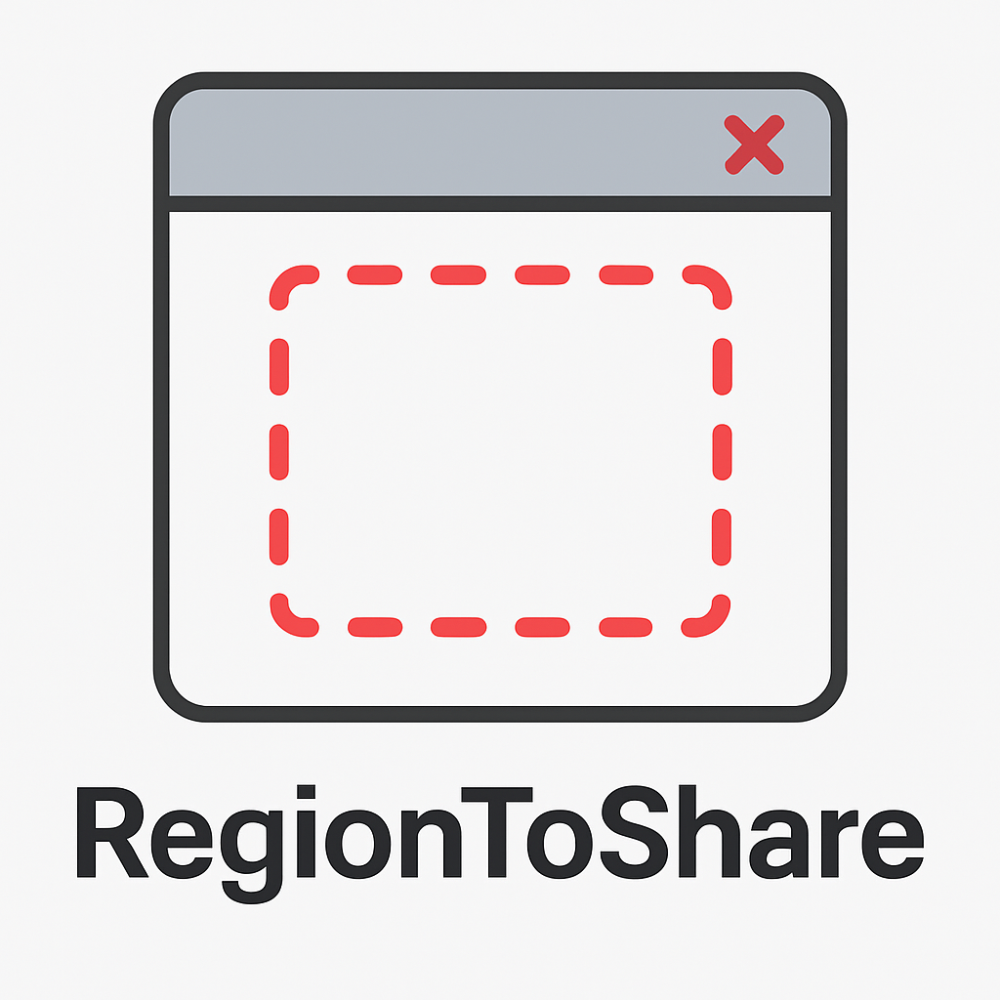

<p align="center">
  
</p>

---

# 🖼️ RegionToShare

> A lightweight Electron-based tool to draw and define a shareable region of the screen using a transparent overlay.

---

## ✨ Features

- 🖱️ Transparent, resizable, and movable overlay
- 🔒 Click-through mode using `setIgnoreMouseEvents`
- 🎹 Toggle interactivity with `Ctrl+Shift+T`
- 📦 Snap packaging (for Linux)
- 🧩 Perfect for screen sharing, recording, or screenshot tools
- 🔐 No data collection – works 100% offline

---

## 🖥️ Installation (Linux via Snap)

```bash
sudo snap install region-to-share
```

## 🚀 Usage

Run from terminal:

```bash
region-to-share
```

### Shortcuts

Ctrl+Shift+T: Toggle between click-through and interactive mode

X button: Close the overlay window

## 🛠️ Development

```bash
# Install dependencies
npm install

# Start Electron app
npm start

# Build Snap package
npm run dist
```

To install the built snap locally:

```bash
sudo snap install --dangerous dist/*.snap
# OR
make dev-install # For lmatest version was build after use : make patch
```

## 📄 License

MIT — Pierre Nicolas / LPDJS
