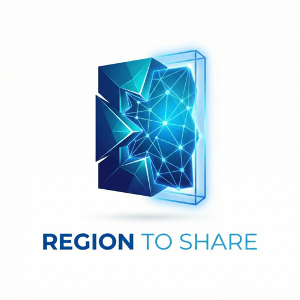

# Region to Share

<p align="center">
  
</p>

**Share any region of your screen in video calls** - A lightweight, native screen region capture tool for Linux.

[](https://snapcraft.io/region-to-share)
[](https://opensource.org/licenses/MIT)

## What is Region to Share?

Region to Share allows you to select a specific area of your screen and display it in a resizable window. This window can then be shared in video conferencing apps like **Google Meet**, **Discord**, **Microsoft Teams**, **Zoom**, or **OBS**.

Perfect for:

- 👨‍🏫 Sharing only part of your screen during presentations
- 🎮 Streaming a specific game window or region
- 💻 Showing code without revealing the rest of your desktop
- 🖥️ Multi-monitor setups where you only want to share a portion

## Features

- 🖱️ **Interactive region selection** - Click and drag to select any screen area
- ⚡ **High performance** - Native Rust implementation with ~5% CPU usage
- 🐧 **Works everywhere** - X11 and Wayland (GNOME, KDE, Sway, Hyprland, etc.)
- 📊 **Performance overlay** - Optional FPS and resource monitoring
- 🔄 **Remember last region** - Quick reuse of previous selection
- 🪟 **Adjustable opacity** - Make the window semi-transparent
- ⬇️ **Auto send-to-background** - Keep it out of the way while streaming
- 🔧 **Debug mode** - `--debug` flag for troubleshooting

## Installation

### Snap (Recommended)

```bash
sudo snap install region-to-share
```

### Build from Source

#### Prerequisites

**Ubuntu/Debian:**

```bash
sudo apt install -y \
  cargo rustc pkg-config \
  libclang-dev clang \
  libx11-dev libxext-dev libxrandr-dev libxcursor-dev libxfixes-dev libxi-dev libxinerama-dev \
  libwayland-dev libxkbcommon-dev \
  libpipewire-0.3-dev libspa-0.2-dev \
  libgl1-mesa-dev libegl1-mesa-dev \
  libdbus-1-dev libfontconfig1-dev libfreetype6-dev
```

**Fedora:**

```bash
sudo dnf install -y \
  cargo rust pkg-config \
  clang-devel clang \
  libX11-devel libXext-devel libXrandr-devel libXcursor-devel libXfixes-devel libXi-devel libXinerama-devel \
  wayland-devel libxkbcommon-devel \
  pipewire-devel \
  mesa-libGL-devel mesa-libEGL-devel \
  dbus-devel fontconfig-devel freetype-devel
```

**Arch Linux:**

```bash
sudo pacman -S --needed \
  rust clang pkgconf \
  libx11 libxext libxrandr libxcursor libxfixes libxi libxinerama \
  wayland libxkbcommon \
  pipewire \
  mesa \
  dbus fontconfig freetype2
```

#### Build

```bash
# Clone the repository
git clone https://github.com/solarpush/region-to-share.git
cd region-to-share

# Build in release mode
cargo build --release

# Run
./target/release/region-ui-egui
```

#### Build Snap Package

```bash
# Install snapcraft
sudo snap install snapcraft --classic

# Build the snap
snapcraft

# Install locally
sudo snap install --dangerous region-to-share_*.snap
```

## Usage

### Basic Usage

1. Launch **Region to Share**
2. Click **"Select a region"**
3. A screenshot overlay appears - click and drag to select your area
4. Press **Enter** or release the mouse to confirm
5. The selected region now appears in a resizable window
6. Share this window in your video conferencing app

### Command Line Options

```bash
region-to-share [OPTIONS]

Options:
  -d, --debug    Enable debug logging
  -v, --verbose  Enable verbose/trace logging (more detailed than debug)
  -h, --help     Print help
  -V, --version  Print version
```

### Settings

- **Frame Rate** - Adjust from 15 to 120 FPS
- **Window Opacity** - Make the streaming window semi-transparent
- **Auto send-to-background** - Automatically lower the window after selection (X11) or minimize (Wayland)
- **Remember last region** - Save and quickly reuse your last selection
- **Show performance** - Display FPS, CPU, and memory usage

## Architecture

Region to Share is built as a Rust workspace with multiple crates:

```
crates/
├── region-core/      # Core types: Rectangle, Frame, PixelFormat
├── region-capture/   # Capture abstraction + X11 backend (XShm)
├── region-portal/    # Wayland backend: Portal + PipeWire + DmaBuf
├── region-config/    # Configuration management
└── region-ui-egui/   # GUI application (egui)
```

### Display Server Support

| Feature           | X11              | Wayland                    |
| ----------------- | ---------------- | -------------------------- |
| Screen capture    | XShm (zero-copy) | Portal + PipeWire + DmaBuf |
| Cursor capture    | XFixes           | Embedded in stream         |
| Window management | Native           | Portal-based               |

## Troubleshooting

### Debug Mode

Run with debug logging to diagnose issues:

```bash
region-to-share --debug
```

For even more detail:

```bash
region-to-share --verbose
```

### Common Issues

**Wayland: "User cancelled" or no permission dialog**

- Make sure your compositor supports the ScreenCast portal
- Try running from a terminal to see error messages

**X11: Black screen or no capture**

- Ensure you have the XShm extension enabled
- Check that your X server allows shared memory

**Snap: Permission issues**

- The snap auto-connects required interfaces, but you can manually connect:
  ```bash
  snap connect region-to-share:pipewire
  snap connect region-to-share:screencast-legacy
  ```

## Contributing

Contributions are welcome! Please feel free to submit a Pull Request.

1. Fork the repository
2. Create your feature branch (`git checkout -b feature/amazing-feature`)
3. Commit your changes (`git commit -m 'Add amazing feature'`)
4. Push to the branch (`git push origin feature/amazing-feature`)
5. Open a Pull Request

## License

This project is licensed under the MIT License - see the [LICENSE](LICENSE) file for details.

## Support

- 🐛 [Report bugs](https://github.com/solarpush/region-to-share/issues)
- ☕ [Buy me a coffee](https://coff.ee/solarpush)

---

Made with ❤️ for the Linux community
